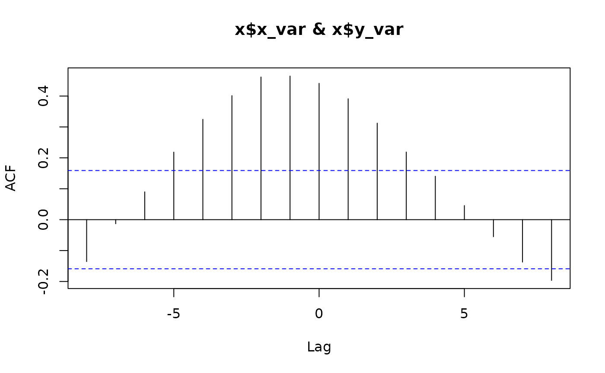
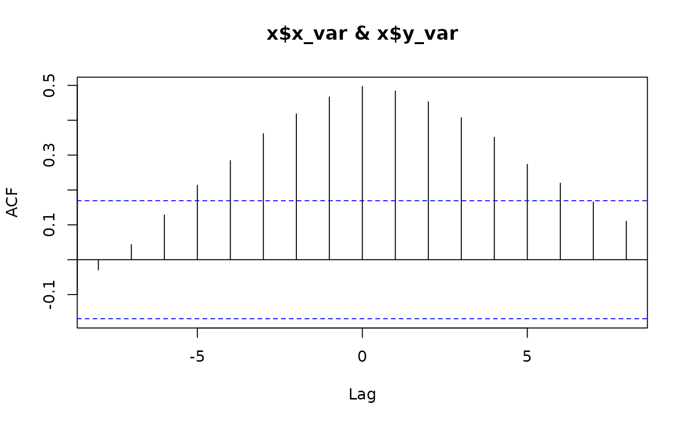
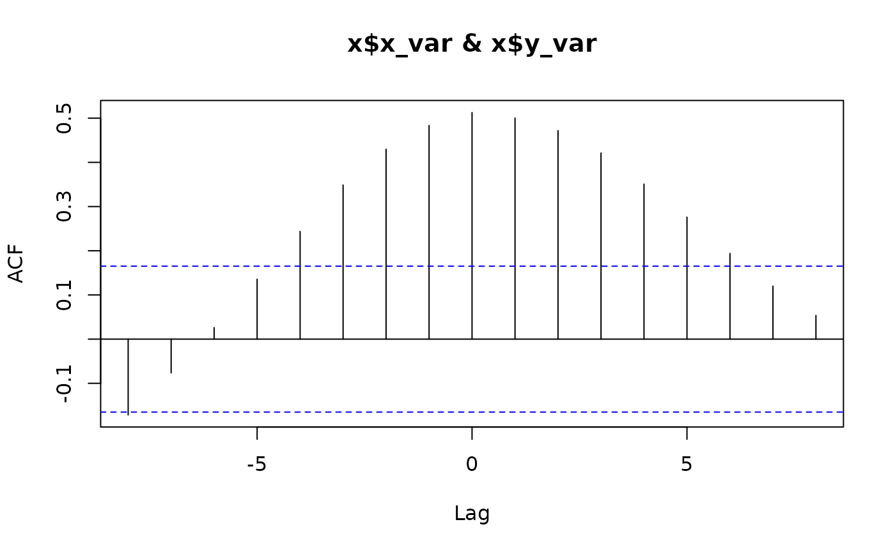
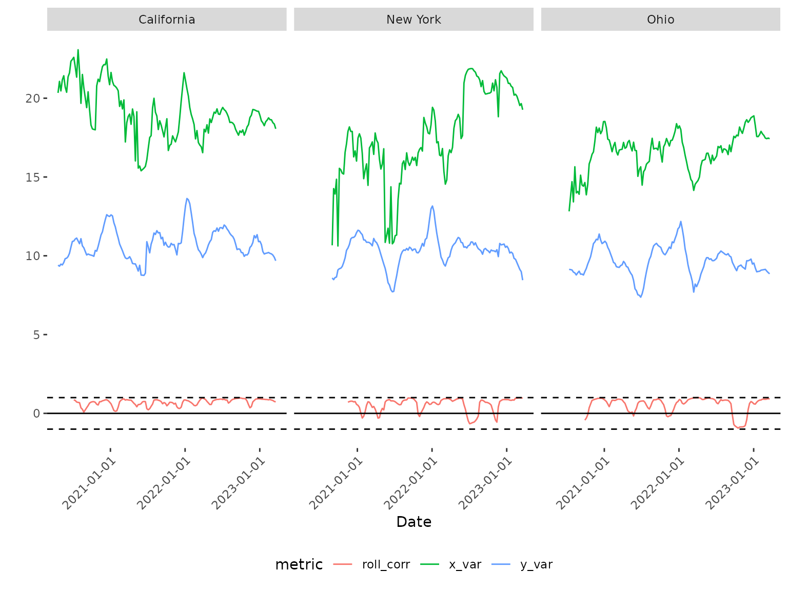
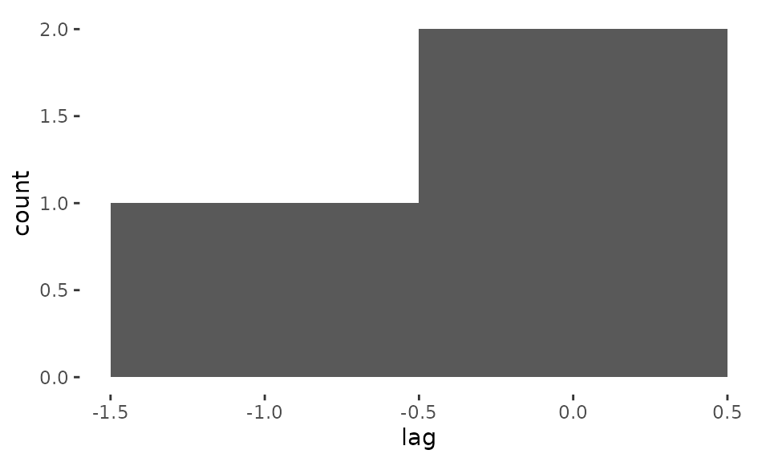

# Get started with pika

`pika` answers two questions about a pair of time series, optionally
repeated across a grouping variable (e.g. region): at what lag are they
most strongly correlated, and how does that correlation change over
time? This page is a fast tour of the core functions on the data bundled
with the package. For two full worked examples with real data and
discussion, see the case studies:
[`vignette("china-mobility-rt")`](https://mrc-ide.github.io/pika/articles/china-mobility-rt.md)
and
[`vignette("wastewater-surveillance")`](https://mrc-ide.github.io/pika/articles/wastewater-surveillance.md).

## Installation

``` r

# install.packages("remotes")
remotes::install_github("mrc-ide/pika")
```

## Lag and rolling correlation

`pika` bundles weekly SARS-CoV-2 wastewater concentration and COVID-19
case counts for three US states (`wastewater_data` and
`covid_case_data`). Joining them gives a pair of time series per state.

``` r

library(dplyr)
library(pika)

data(wastewater_data)
data(covid_case_data)

dat <- inner_join(wastewater_data, covid_case_data, by = c("state", "date")) %>%
  mutate(log_conc = log(conc), log_cases = log(cases + 1))
```

[`cross_corr()`](https://mrc-ide.github.io/pika/reference/cross_corr.md)
finds the lag (in rows of your data – here, weeks) at which two
variables are most strongly correlated, separately for each level of
`grp_var`:

``` r

lags <- cross_corr(
  dat = dat, date_var = "date", grp_var = "state",
  x_var = "log_conc", y_var = "log_cases", max_lag = 8
)
```



``` r

lags
#> # A tibble: 3 × 2
#>   state        lag
#>   <chr>      <dbl>
#> 1 California    -1
#> 2 New York       0
#> 3 Ohio           0
```

[`rolling_corr()`](https://mrc-ide.github.io/pika/reference/rolling_corr.md)
then calculates the correlation between the two variables in a moving
window, so you can see whether that relationship is stable over time
rather than assuming a single lag/correlation applies throughout:

``` r

dat_corr <- rolling_corr(
  dat = dat, date_var = "date", grp_var = "state",
  x_var = "log_conc", y_var = "log_cases", n = 12
)
tail(dat_corr, 3)
#> # A tibble: 3 × 9
#>   state date           conc n_sites n_samples cases log_conc log_cases roll_corr
#>   <chr> <date>        <dbl>   <int>     <int> <dbl>    <dbl>     <dbl>     <dbl>
#> 1 Ohio  2023-03-06   3.72e7      71       138  8332     17.4      9.03     0.907
#> 2 Ohio  2023-03-13   3.87e7      71       139  7586     17.5      8.93     0.942
#> 3 Ohio  2023-03-20   3.70e7      71       136  7016     17.4      8.86     0.906
```

[`plot_corr()`](https://mrc-ide.github.io/pika/reference/plot_corr.md)
visualizes both series alongside the rolling correlation, faceted by
group:

``` r

plot_corr(
  dat = dat_corr, date_var = "date", grp_var = "state",
  x_var = "log_conc", y_var = "log_cases"
)
```



[`plot_lag()`](https://mrc-ide.github.io/pika/reference/plot_lag.md)
plots a histogram of the lags returned by
[`cross_corr()`](https://mrc-ide.github.io/pika/reference/cross_corr.md)
across groups, which is more useful with many groups than the three
shown here. Note that `bins` is passed directly to
[`ggplot2::geom_histogram()`](https://ggplot2.tidyverse.org/reference/geom_histogram.html)’s
`binwidth`, not a bin *count* – with only a couple of lag values
spanning a narrow range, as here, the default `bins = 2` bins everything
into a single bar spanning the whole plot, so we use a narrower value:

``` r

plot_lag(dat = lags, lag_var = "lag", bins = 1)
```



## Other functions

[`calc_percent_change()`](https://mrc-ide.github.io/pika/reference/calc_percent_change.md)
converts a count variable into percent change relative to the average
value in a baseline period:

``` r

pct <- calc_percent_change(
  dat = wastewater_data, date_var = "date", grp_var = "state",
  count_var = "conc", n_baseline_periods = 4
)
tail(pct, 3)
#>     state       date     conc n_sites n_samples perc_change
#> 428  Ohio 2023-03-13 38665603      71       139          NA
#> 429  Ohio 2023-03-20 37030318      71       136          NA
#> 430  Ohio 2023-03-27 27581399      69        81          NA
```

[`estimate_rt()`](https://mrc-ide.github.io/pika/reference/estimate_rt.md)
wraps
[`EpiEstim::estimate_R()`](https://rdrr.io/pkg/EpiEstim/man/estimate_R.html)
to estimate the effective reproduction number (Rt) from case or death
counts, by group:

``` r

data(china_case_data)
rt <- estimate_rt(
  dat = china_case_data, grp_var = "province",
  date_var = "date", incidence_var = "cases"
)
tail(rt, 3)
#>     date_start   date_end      province   r_mean   r_q2.5  r_q97.5 r_median
#> 432 2020-03-16 2020-03-22 Hong_Kong_SAR 3.263403 2.791268 3.771887 3.257007
#> 433 2020-03-17 2020-03-23 Hong_Kong_SAR 3.080868 2.668662 3.522245 3.075735
#> 434 2020-03-18 2020-03-24 Hong_Kong_SAR 2.720479 2.372844 3.091530 2.716358
```

## Learn more

For a full worked example that estimates Rt and determines its lagged
relationship with mobility, reproducing published results, see
[`vignette("china-mobility-rt")`](https://mrc-ide.github.io/pika/articles/china-mobility-rt.md).
For an example that tests whether wastewater surveillance is a reliable
leading indicator for clinical case counts, see
[`vignette("wastewater-surveillance")`](https://mrc-ide.github.io/pika/articles/wastewater-surveillance.md).
