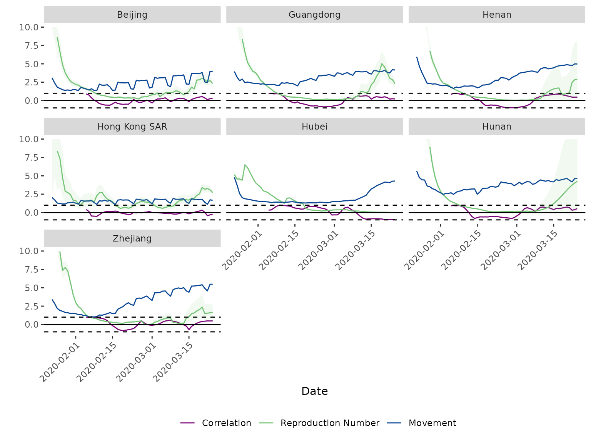

# pika: A lightweight package for evaluating correlation between time series

## Overview

`pika` is a lightweight package that enables easily estimating the
optimal lag and rolling corrleation between two time series. This
package was dveloped for use with epidemiological data and mobility
data, but can be used more generally for other time series. The main
utility of this package is the ability to determine quantities of
interest by a grouping variable, such as the rolling correlation between
two time series for different locations. This vignette goes over the
different functionality of `pika` in an epidemiological context, namely
determining the optimal lag and rolling correlation between estimates of
reproduction number (the average number of new cases generated by a
single case) and mobility within the population within different regions
of China during the COVID-19 pandemic.

### Data

`pika` contains several example data sets in the `data/` directory that
can be used to run through the package functions. The example data sets
include 1. Daily confirmed cases of COVID-19 from different provinces in
China (china_case_data) 2. Daily within-city movement data for the same
provinces in 1 (exante_movement_data)

The case data has daily confirmed confirmed cases for different
provinces in China from 16 January to 24 March 2020 from the dashboard
maintained by Chinese Center for Disease Prevention and Control (CCDC)
\[1\]. The CCDC dashboard collates numbers of confirmed cases reported
by national and local health commissions in each province in mainland
China, and Hong Kong SAR and Macau SAR. Confirmed cases are defined as
suspected cases, who have epidemiological links and/or clinical
symptoms, and are detected with SARS-CoV-2 by PCR tests. However, in
Hubei province, clinically diagnosed cases were additionally included
between 12 and 19 February.

The daily within-city movement data, used as a proxy for economic
activity, is available from 1 January to 24 March 2020 for major
metropolitan cities within each province in mainland China, Hong Kong
SAR, and Macau SAR. These data, provided by Exante Data Inc \[2\],
measured travel activity relative to the 2019 average (excluding Lunar
New Year). The underlying data are based on near real-time people
movement statistics from Baidu.

### Estimate effective reproduction number

To estimate the effective reproduction number (Rt), pika has a function
[`estimate_rt()`](https://mrc-ide.github.io/pika/reference/estimate_rt.md)
that provides a wrapper for
[`EpiEstim::estimate_R()`](https://rdrr.io/pkg/EpiEstim/man/estimate_R.html)
\[3\] that enables users to estimate Rt by a grouping variable. As input
[`estimate_rt()`](https://mrc-ide.github.io/pika/reference/estimate_rt.md)
takes a data frame of daily cases or deaths by group. `pika` includes an
example data set `china_case_data.rda` that includes daily reported
cases of COVID-19 from several provinces in China between 16 January
2020 and 24 March 2020.

| date       | province      | cases |
|:-----------|:--------------|------:|
| 2020-01-16 | Hubei         |     4 |
| 2020-01-16 | Guangdong     |     0 |
| 2020-01-16 | Zhejiang      |     0 |
| 2020-01-16 | Henan         |     0 |
| 2020-01-16 | Hunan         |     0 |
| 2020-01-16 | Beijing       |     0 |
| 2020-01-16 | Hong_Kong_SAR |     0 |
| 2020-01-17 | Hubei         |    17 |
| 2020-01-17 | Guangdong     |     0 |
| 2020-01-17 | Zhejiang      |     0 |

To estimate Rt from case data, the user must specify the data set in the
`dat =` argument of
[`estimate_rt()`](https://mrc-ide.github.io/pika/reference/estimate_rt.md).
The data set should include three columns: a date column (this should be
of class ‘date’), a grouping variable, and the value used to estimate Rt
(most commonly this is cases, but other quantities can be used, such as
deaths). The names of the columns in the input data set should be
specified as character strings in the `grp_var =`, `date_var =`, and
`incidence_var =` arguments.

``` r
# to estimate them with pika, use estimate_rt() ------------------------------------------
rt_estimates <- estimate_rt(dat = china_case_data,
                            grp_var = "province",
                            date_var = "date",
                            incidence_var = "cases"
                            ) %>%
  # a little data formatting--------------------------------------------------------------
  mutate(province = to_snake_case(province)) %>%
  select(-date_start) %>%
  rename("date" = "date_end")
```

| date       | province |   r_mean |   r_q2.5 |  r_q97.5 | r_median |
|:-----------|:---------|---------:|---------:|---------:|---------:|
| 2020-01-23 | hubei    | 5.158792 | 4.718609 | 5.618324 | 5.155387 |
| 2020-01-24 | hubei    | 4.572393 | 4.232182 | 4.925570 | 4.570112 |
| 2020-01-25 | hubei    | 4.561455 | 4.273269 | 4.858912 | 4.559824 |
| 2020-01-26 | hubei    | 4.409607 | 4.166198 | 4.659828 | 4.408408 |
| 2020-01-27 | hubei    | 6.501828 | 6.246638 | 6.762055 | 6.500942 |
| 2020-01-28 | hubei    | 6.117626 | 5.906827 | 6.332068 | 6.116984 |
| 2020-01-29 | hubei    | 5.421957 | 5.258101 | 5.588293 | 5.421521 |
| 2020-01-30 | hubei    | 4.719259 | 4.592553 | 4.847667 | 4.718960 |
| 2020-01-31 | hubei    | 4.086316 | 3.987002 | 4.186835 | 4.086104 |
| 2020-02-01 | hubei    | 3.743788 | 3.662311 | 3.826149 | 3.743632 |

The method used to estimate Rt can be changed using the `est_method =`
argument. This argument takes the following options:
`c("non_parametric_si","parametric_si","uncertain_si","si_from_data","si_from_sample")`.
For methods that require specifying the mean and standard deviation of
the serial interval, these parameters can be set using the `si_mean =`
and `si_std =` function arguments. The default values are
`si_mean = 6.48` and `si_std = 3.83` \[4\].

For more information on the methodology underlying
[`EpiEstim::estimate_R`](https://rdrr.io/pkg/EpiEstim/man/estimate_R.html)
look at this
[vignette](https://cran.r-project.org/web/packages/EpiEstim/vignettes/demo.html)
or at `help("estimate_R")`.

## Lag

When determining the relationship between two time series it is
sometimes of interest to determine the lag at which the correlation
between the two time series is highest, we’ll call this the optimal lag.
To determine the optimal lag, the two time series must first be merged
into a single data frame. We do this below using `dplyr`’s `left_join()`
by `date` and `province`.

``` r
# Join data sets together by date and province to determine cross correlation -----------
# for this we are using input rt estimates, not those estimated using pika::estimate_rt()
data_joined <- left_join(rt_estimates,
                         exante_movement_data,
                         by = c("date","province")
                         )
```

| date       | province |   r_mean |   r_q2.5 |  r_q97.5 | r_median | movement |
|:-----------|:---------|---------:|---------:|---------:|---------:|---------:|
| 2020-01-23 | hubei    | 5.158792 | 4.718609 | 5.618324 | 5.155387 | 4.792658 |
| 2020-01-24 | hubei    | 4.572393 | 4.232182 | 4.925570 | 4.570112 | 3.774731 |
| 2020-01-25 | hubei    | 4.561455 | 4.273269 | 4.858912 | 4.559824 | 2.573851 |
| 2020-01-26 | hubei    | 4.409607 | 4.166198 | 4.659828 | 4.408408 | 2.020488 |
| 2020-01-27 | hubei    | 6.501828 | 6.246638 | 6.762055 | 6.500942 | 1.876848 |
| 2020-01-28 | hubei    | 6.117626 | 5.906827 | 6.332068 | 6.116984 | 1.817556 |
| 2020-01-29 | hubei    | 5.421957 | 5.258101 | 5.588293 | 5.421521 | 1.766298 |
| 2020-01-30 | hubei    | 4.719259 | 4.592553 | 4.847667 | 4.718960 | 1.662975 |
| 2020-01-31 | hubei    | 4.086316 | 3.987002 | 4.186835 | 4.086104 | 1.603111 |
| 2020-02-01 | hubei    | 3.743788 | 3.662311 | 3.826149 | 3.743632 | 1.546469 |

We can then identify the optimal lag by calculating the cross
correlation between the two time series by the grouping variable at
different lags using the `cross_corr` function. The argument `max_lag =`
specifies the maximum lag to test. In the below example it is set to 10
days. The `subset_date =` argument allows the user to determine the
cross correlation between the two time series for a subset of the time
window.

``` r
# # Determine lag with max cross correlation between Rt and movement ----------------------
lags <- cross_corr(dat = data_joined,
                   date_var = "date",
                   grp_var = "province",
                   x_var = "r_mean",
                   y_var = "movement",
                   max_lag = 10,
                   subset_date = "2020-02-15"
                  )

# use min lag across groups -------------------------------------------------------------
my_lag <- min(lags$lag)
```

Once the optimal lag is determined, we must back date our Rt estimates
without impacting the date of the movement variable.

``` r
# create lag date using max lag from cross_corr() ---------------------------------------
data_joined_lag <- rt_estimates %>%
  mutate(date = date + my_lag) %>%
  left_join(., exante_movement_data, by = c("date", "province"))
```

## Percent change relative to baseline

Sometimes, it is of interest to convert a count variable over time into
a percent change based on the average value in a specified baseline
period. Using
[`calc_percent_change()`](https://mrc-ide.github.io/pika/reference/calc_percent_change.md)
users can specify a baseline period that will them be used to determine
the percent change in their count variable time series. This function
was written for application to mobility data, where the percent change
in mobility over time relative to baseline is of interest. However, this
function can be applied to any count type time series.

``` r
perc_change_data <- calc_percent_change(dat = exante_movement_data,
                                        date_var = "date",
                                        grp_var = "province", 
                                        count_var = "movement", 
                                        n_baseline_periods = 7)
```

| date       | province | movement | perc_change |
|:-----------|:---------|---------:|------------:|
| 2020-01-01 | anhui    | 5.131897 |   0.9674739 |
| 2020-01-02 | anhui    | 5.585968 |   1.0530762 |
| 2020-01-03 | anhui    | 5.675878 |   1.0700261 |
| 2020-01-04 | anhui    | 5.191629 |   0.9787347 |
| 2020-01-05 | anhui    | 4.821942 |   0.9090406 |
| 2020-01-06 | anhui    | 5.421992 |   1.0221631 |
| 2020-01-07 | anhui    | 5.301700 |   0.9994855 |
| 2020-01-08 | anhui    | 5.636145 |   1.0625356 |
| 2020-01-09 | anhui    | 5.463023 |   1.0298983 |
| 2020-01-10 | anhui    | 5.633986 |   1.0621285 |

## Rolling correlation

It is often of interest to determine the relationship between two time
series, specifically the rolling correlation. The
[`rolling_corr()`](https://mrc-ide.github.io/pika/reference/rolling_corr.md)
function calculates the rolling correlation between two times series
(`x_var` and `y_var`) over a specified time window `n =`. Here, we
calculate the biweekly rolling correlation between Rt and movement.
Since our data is daily estimates of Rt and movement, we set `n = 14`.
If our data was monthly and we wanted to determine a 6 month rolling
correlation, we would set `n = 6`. The output of
[`rolling_corr()`](https://mrc-ide.github.io/pika/reference/rolling_corr.md)
is a data frame with an additional column added to the input dataset
called “rolling_corr”. Depending on the value of `n`, the first `n`
values of “rolling_corr” are NA.

``` r
# Determine rolling correlation between Rt and movement ---------------------------------
data_corr <- rolling_corr(dat = data_joined_lag,
                          date_var = "date",
                          grp_var = "province",
                          x_var = "r_mean",
                          y_var = "movement",
                          n = 14)
```

To visualise the rolling correlation, the results of
[`rolling_corr()`](https://mrc-ide.github.io/pika/reference/rolling_corr.md)
can be plotted using
[`plot_corr()`](https://mrc-ide.github.io/pika/reference/plot_corr.md).
This creates a plot of the two time series and the rolling correlation
between them facetted by grouping variable. There are optional arguments
to change the facet labels (`facet_lables =`), legend_labels
(`legend_labels =`), add confidence bounds for the primary time series
(`x_var_lower =` and `x_var_upper =`), and set a maximum value for the
y-axis (`y_max =`). The below code plots the mean Rt estimates with 95%
confidence bands, movement index, and the biweekly correlation between
them. We also specify custom facet and legend labels and restrict the
y-axis to a maximum value of 10.

``` r
# Plot Rt, movement, and correlation ----------------------------------------------------
my_labels <- c("beijing" = "Beijing", "guangdong" = "Guangdong", "henan" = "Henan",
               "hong_kong_sar" = "Hong Kong SAR", "hubei" = "Hubei", "hunan" = "Hunan",
               "zhejiang" = "Zhejiang")
my_legend = c("Correlation", "Reproduction Number", "Movement")

plot_corr(dat = data_corr,
          date_var = "date",
          grp_var = "province",
          x_var = "r_mean",
          y_var = "movement",
          x_var_lower = "r_q2.5",
          x_var_upper = "r_q97.5",
          facet_labels = my_labels,
          legend_labels = my_legend,
          y_max = 10
          )
```



## References

1\.

Distribution of the novel coronavirus-infected pneumonia \[chinese\].
<http://2019ncov.chinacdc.cn/2019-nCoV/>; 2020.

2\.

Exante Data Inc. 114 E 25th Street New York, NY 10010 USA; 2020.

3\.

Cori A. EpiEstim: Estimate time varying reproduction numbers from
epidemic curves. 2019.

4\.

Ferguson NM, Laydon D, Nedjati-Gilani G, Imai N, Ainslie K, Baguelin M,
et al. Impact of non-pharmaceutical interventions (NPIs) to reduce
COVID-19 mortality and healthcare demand.
